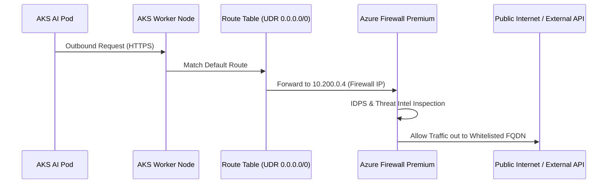
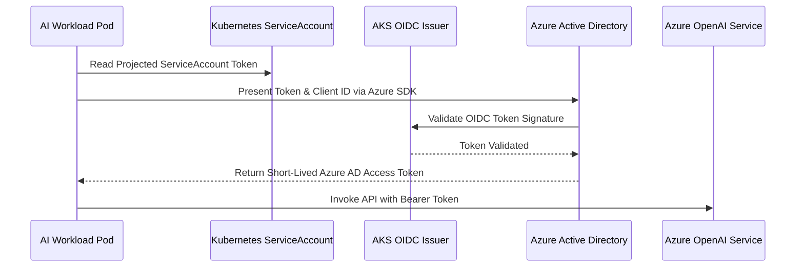

# Enterprise Azure Landing Zone Architecture Specification

## 1. Network Topology & Traffic Flow

The architecture follows a Hub-and-Spoke topology designed to guarantee multi-tenant isolation, forced tunneling, and zero-trust security boundaries.

### Core IP Address Allocation Plan

| Network Zone | Resource | CIDR Block | Purpose |
|--------------|----------|------------|---------|
| **Hub Network** | Virtual Network | `10.200.0.0/16` | Central Ingress, Egress, and Inspection |
| Hub Subnet | `AzureFirewallSubnet` | `10.200.0.0/24` | Azure Firewall Premium IDPS |
| Hub Subnet | `AzureBastionSubnet` | `10.200.1.0/24` | Bastion Administrative Access |
| **Dev Spoke** | Virtual Network | `10.100.0.0/16` | Development AI Sandbox |
| Dev Subnet | `snet-aks-nodes` | `10.100.0.0/20` | Private AKS System/User/GPU Nodes |
| Dev Subnet | `snet-private-endpoints` | `10.100.16.0/24` | PaaS Private Link Integration |
| **Prod Spoke**| Virtual Network | `10.1.0.0/16` | Production Mission-Critical AI |
| Prod Subnet | `snet-aks-nodes` | `10.1.0.0/20` | HA AKS Node Pools (Multi-AZ) |
| Prod Subnet | `snet-private-endpoints` | `10.1.16.0/24` | PaaS Private Endpoints |

---

## 2. Egress Traffic Routing Flow (UDR Forced Tunneling)

All outbound internet traffic from AKS nodes is routed through User Defined Routes (UDR) to Azure Firewall Premium for deep packet inspection (DPI):

---

## 3. Workload Identity & Secretless Security

Secrets and API keys are never hardcoded or stored in Kubernetes ConfigMaps. Workload Pods exchange Azure AD OIDC tokens directly with Azure services:

